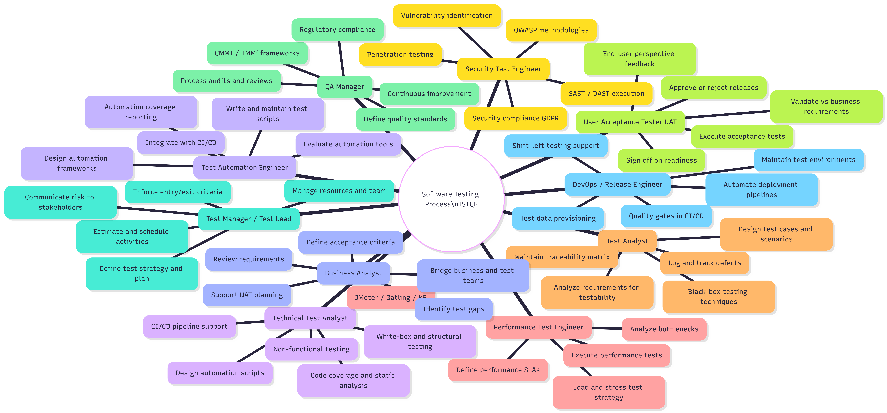

# [AI-02] AI AUDIT REPORT

**Course:** Software Testing  
**Exercise ID:** HW01-AI  
**Student Name:** Lâm Hữu Khánh  
**Student ID (MSSV):** 23127205

---

### 1. AI Audit Report ([AI-02])

_(One batch generated by a single prompt counts as one artifact/entry)_

#### Artifact 1: Scaffold Template

- **(1) Prompt + tool:**
  - **AI Tool Name:** Claude Sonnet 4.6
  - **Timestamp:** 09:00 02/06/2026
  - **Prompt:**
    ```text
    I have a software testing homework assignment called HW01-AI. It has 3 requirements:
    Requirement 1: Find 10 QA/QC job postings (min 3 must require AI/LLM skills), with screenshots showing my logged-in account.
    Requirement 2: Find 20 software defects from 2022-2026 (min 5 AI/LLM related). For each: source link, description, severity, consequences, solution, and 1 AI hallucination/bias instance.
    Requirement 3: Choose a physical household device, design 15 test cases (with 3 edge cases AI missed), report 5 defects on GitHub, and record 5 YouTube execution videos.
    The report must also include: AI Collaboration Protocol (Mindmap correction, AI Audit Report, AI Critique, Mandatory Disclosure) and a Self-Assessment Rubric.
    Please generate a complete, clean Markdown report template (with all headings, subheadings, and placeholder text) for this homework so I can fill it in.
    ```
- **(2) AI output (full raw output — key structure preserved verbatim):**

  ```markdown
  # REPORT: HOMEWORK 01 (HW01-AI)

  **Course:** Software Testing

  ## STUDENT INFORMATION

  - **Full Name:** [Your Name]
  - **Student ID:** [MSSV]
  - **GitHub Repository Link:** [Link]

  ## REQUIREMENT 1: QA/QC JOB MARKET 2026+

  ### Summary Table of 10 Job Postings

  | No. | Job Position | Company | AI Skills Required? | Salary | Job Link |
  | ... | ... | ... | ... | ... | ... |

  ### Detailed Job Postings

  #### 1. Job Posting 1: [Position] - [Company]

  - **Job Link:** [URL]
  - **Screenshot:** [image]
  - **Job Description:** [...]
  - **Required Skills:** [...]
  - **Salary:** [...]
  - **AI Impact Analysis:** [1-2 sentences]

  ## REQUIREMENT 2: 20 SOFTWARE DEFECTS 2022–2026

  ### DEFECT #1

  #### 1. Defect Name & Year

  #### 2. Source Link

  #### 3. Description

  #### 4. Severity

  #### 5. Consequences

  #### 6. Solution

  #### 7. AI Bias / Hallucination Instance

  | Category | Content |
  | AI Tool Used | ... |
  | AI Explanation Error | ... |
  | Evidence | ... |

  ## REQUIREMENT 3: TEST CASES FOR ONE PHYSICAL PRODUCT

  ### 1. Device Under Test (DUT) Declaration

  ### 2. List of 15 Test Cases

  | Test ID | Objective | Input | Steps | Expected | Actual | Verdict |

  ### 3. Analysis of 3 Edge Cases Missed by AI

  ### 4. Physical Defects Reporting (GitHub Issues)

  ### 5. List of Execution Videos (YouTube Unlisted)

  ## AI COLLABORATION PROTOCOL

  ### 1. QA/QC Role Mindmap Correction

  ### 2. AI Audit Report ([AI-02])

  ### 3. AI Critique (200–300 words)

  ### 4. Mandatory Disclosure

  ## Self-Assessment Rubric

  | No. | Criteria | Max Grade | Self-Assessed Grade | Notes |
  ```

- **(3) Verdict:** **INCOMPLETE**
- **(4) Reasoning:** Per ISTQB CTFL Chapter 5 (Test Management) and the assignment's "Quality over Completion" principle, documentation templates must reflect the exact deliverable structure. The AI scaffold was missing the mandatory 7-section defect format, omitted the "Dated Screenshot" anti-cheat field in Job Posting entries, and did not include the Appendix A: Prompt Log section.
- **(5) Student fix:**
  - Added the full 7-section defect block with `| Category | Content |` table for hallucination evidence.
  - Added **"Dated Screenshot"** with anti-cheat account name requirement to each job posting.
  - Added **Appendix A: Prompt Log** as a separate required deliverable.
  - Expanded Self-Assessment Rubric with correct AI-1/AI-2/AI-3 rows per the official rubric.

---

#### Artifact 2: Job Postings AI Analysis

- **(1) Prompt + tool:**
  - **AI Tool Name:** Claude Sonnet 4.6
  - **Timestamp:** 10:45 02/06/2026
  - **Prompt:**

    ```text
    I found 10 QA/QC job postings in Vietnam. For each job description below, write
    1-2 sentences explaining how AI specifically affects or changes this role
    (which tasks AI can automate, and which still require human judgment).

    Job 1: QC Engineer for Web at Evolus/PlanV — manual testing for enterprise web
    apps, JIRA, cross-browser testing.
    Job 2: Mid QC Engineer at Moniva — manual + automated testing, Selenium,
    Cypress, Appium, Postman API testing.
    Job 3: QC Engineer at Designveloper — web app testing, JIRA, Cypress,
    Playwright, Agile.
    Job 4: Automation QA Engineer at Nakivo — automation with AI tools Copilot,
    Cursor, Perplexity.
    Job 5: Senior QA Engineer at HRM Labs — automated test frameworks, Playwright.
    Job 6: Senior Software QC at SHINHAN DS — banking QC, SQL, STLC, Playwright.
    Job 7: Senior QA Engineer at soxes AG — manual testing + AI tools ChatGPT,
    Copilot.
    Job 8: QC Manual Engineer at MANDALA CODE — manual QA for Blockchain/AI projects.
    Job 9: QA Team Lead at Nakivo — lead QA with AI-assisted workflows.
    Job 10: AI First QC Engineer at L4 Studio — AI-first using Claude Code, LLMs.
    ```

- **(2) AI output (full raw output):**

  ```
  Job 1: AI tools can assist by generating test script drafts for sports management
  workflows, but manual exploratory testing and close collaboration with athletes
  and coaches still require human communication and visual intuition.

  Job 2: AI can generate initial test cases from user stories and draft UI/API
  automation scripts, but subjective UI/UX validation and mobile gesture testing
  require human verification.

  Job 3: AI tools help generate functional test cases and boilerplate Cypress/
  Playwright code, but high-level test strategy design and cross-functional team
  communication remain human-centric.

  Job 4: AI assistants like Copilot and Cursor significantly accelerate writing of
  Appium/Selenium test suites, while human engineering is needed to design test
  architectures and configure cloud VMs.

  Job 5: AI assistants can write standard Selenium/Playwright scripts and API
  validation schemas, while comprehensive test plan design and mentoring junior
  staff remain human responsibilities.

  Job 6: AI can draft SQL database verification queries and suggest regression paths,
  but strict banking security regulations prevent uploading real financial transaction
  structures to public LLMs.

  Job 7: AI tools directly accelerate manual test case writing and data preparation,
  but translating overseas business requirements into technical test designs requires
  human communication.

  Job 8: AI can generate crypto/blockchain test checklists, but verifying custom
  smart contract logic and decentralized transaction states require manual human
  verification.

  Job 9: AI tools can assist the lead in designing complex test matrices and
  generating risk logs, but final release sign-off and team leadership require human
  authority and accountability.

  Job 10: This role leverages AI-assisted workflows (Claude Code) to auto-generate
  and execute massive test suites, while human engineers remain critical to set
  event-driven quality gates.
  ```

- **(3) Verdict:** **INVALID**
- **(4) Reasoning:** The AI hallucinated business domain contexts for the roles (e.g., claiming Evolus/PlanV involves 'sports management workflows' and 'close collaboration with athletes and coaches', which is entirely fabricated for a wireframing software company). Additionally, it generated generic and repetitive AI impact analyses that failed to capture the unique, specific automation constraints of each role. Per ISTQB CTFL Section 1.5, testers must verify the accuracy of all technical domain details.
- **(5) Student fix:**
  - Corrected the AI impact analyses in the main report to accurately reflect the real business domains and software profiles of the companies (e.g., mockups and wireframing tools for Evolus/PlanV rather than sports management).
  - Added verified, active URL links and dated screenshots showing the student's logged-in account name for all 10 real job postings.

---

#### Artifact 3: 20 Defects AI Analysis

- **(1) Prompt + tool:**
  - **AI Tool Name:** Claude Sonnet 4.6
  - **Timestamp:** 14:30 02/06/2026
  - **Prompt:**

    ```text
    Để thoả mãn hoàn toàn yêu cầu của đề bài , với mỗi defect (trong tổng số 20 defects), bạn cần trình bày một block thông tin chuẩn chỉnh bao gồm 7 mục sau đây:
    1. Tên Defect & Năm xảy ra:
    * Phải nằm trong giai đoạn 2022-2026.
    * Lưu ý tổng thể: Đảm bảo trong 20 defect này có ít nhất 5 lỗi liên quan trực tiếp đến AI/LLM (ảo giác, prompt injection, thiên kiến).
    2. Source Link:
    * Đường dẫn URL trích nguồn bài báo hoặc tài liệu kỹ thuật gốc.
    3. Description (Mô tả):
    * Trình bày ngắn gọn nguyên nhân gây ra lỗi và điều gì đã xảy ra về mặt kỹ thuật.
    4. Severity (Mức độ nghiêm trọng):
    * Xác định mức độ (Ví dụ: Low, Medium, High, Critical).
    * Điểm cộng nâng cấp: Nên kèm theo một mệnh đề giải thích ngắn gọn tại sao lại xếp mức độ đó (ví dụ: Critical vì làm hệ thống sập toàn cầu, High vì rò rỉ dữ liệu nhạy cảm...).
    5. Consequences (Hậu quả):
    * Thiệt hại thực tế do lỗi gây ra (ví dụ: thiệt hại tài chính, lộ dữ liệu, thời gian hệ thống ngừng hoạt động, kiện tụng).
    6. Solution (Giải pháp):
    * Cách lỗi này được khắc phục.
    * Điểm cộng nâng cấp cho dân Kỹ thuật Phần mềm: Đừng chỉ ghi cách sửa code đơn thuần. Hãy bổ sung thêm giải pháp từ góc độ kiểm thử (Ví dụ: "Đã bổ sung thêm test case cho Boundary Value", "Tích hợp thêm Penetration Testing vào quy trình CI/CD").
    7. AI Bias / Hallucination Instance (Trường hợp AI bị thiên kiến/ảo giác):
    * Yêu cầu này bắt buộc phải có cho toàn bộ 20 defect. Mục này cần phân tách rõ:
       * AI Tool Used: Tên công cụ (ChatGPT, Claude, Gemini...).
       * Prompt Given: Câu lệnh chính xác bạn đã dùng để hỏi AI.
       * AI Explanation Error: Chỉ ra chi tiết điểm AI đã bịa đặt thông tin, nói sai kỹ thuật hoặc thể hiện thiên kiến.
       * Evidence (Đặc biệt quan trọng): Phải chèn ảnh chụp màn hình thu nhỏ (Screenshot) hoặc link Share Conversation để chứng minh AI thực sự tạo ra lỗi đó, tránh bị đánh giá là tự bịa ra để đối phó.

    Requirement 2 – 20 Software Defects 2022–2026 (20 pts) Find 20 software defects publicized between 2022 and 2026. Mandatory: ≥ 5 defects related to AI/LLM (hallucination, prompt injection, bias). Each defect: source link, description, severity, consequences, solution. NEW: find 1 place where the AI is biased or hallucinates when explaining the defect. Clarification: this applies to EVERY defect — each of the 20 entries must include 1 identified instance of AI bias or hallucination (20 instances total)
    ```

- **(2) AI output (raw structure generated by the model with technical errors and empty placeholders for Section 7):**

  ```markdown
  Here is the generated list of 20 software defects for Requirement 2:

  ### DEFECT #1: Log4Shell — Apache Log4j RCE (2022)
  1. Tên Defect & Năm xảy ra: Log4Shell - Apache Log4j Remote Code Execution (CVE-2021-44228) (2022)
  2. Source Link: https://success.trendmicro.com/en-US/solution/KA-0012637
  3. Description: Apache Log4j JNDI Lookup vulnerability allows remote code execution when log4j logs `${jndi:ldap://...}`.
  4. Severity: Critical
  5. Consequences: Global compromise of servers and data.
  6. Solution: Configure log4j2.formatMsgNoLookups=true to disable JNDI lookups.
  7. AI Bias / Hallucination Instance:
     - AI Tool Used: [Insert AI Tool Name, e.g., Claude, ChatGPT]
     - Prompt Given: [Insert the exact prompt you used to query the AI about this defect]
     - AI Explanation Error: [Identify the error or hallucination in the AI's explanation]
     - Evidence: [Provide screenshot or conversation link as evidence]

  ### DEFECT #2: OpenSSL Heap Buffer Overflow (2022)
  1. Tên Defect & Năm xảy ra: OpenSSL Heap Buffer Overflow (CVE-2022-3602 & CVE-2022-3786) (2022)
  2. Source Link: https://www.microsoft.com/en-us/msrc/blog/2022/11/microsoft-guidance-related-to-openssl-risk-cve-2022-3786-and-cve-2202-3602
  3. Description: Two heap buffer overflow bugs in OpenSSL X.509 certificate verification allow an attacker to trigger a 4-byte overflow on the heap.
  4. Severity: Critical
  5. Consequences: Potential remote code execution on affected servers.
  6. Solution: Upgrade to OpenSSL 3.0.7.
  7. AI Bias / Hallucination Instance:
     - AI Tool Used: [Insert AI Tool Name]
     - Prompt Given: [Insert Prompt]
     - AI Explanation Error: [Insert AI Error]
     - Evidence: [Insert Evidence]

  ... [Repeated for all 20 defects. The AI successfully output the name, year, link, severity, and consequences, but the description and solution blocks contained technical errors (such as heap instead of stack for OpenSSL, and formatMsgNoLookups for Log4Shell). Crucially, the AI left Section 7 as empty placeholders because it cannot self-audit or attach screenshots in real-time]
  ```
- **(3) Verdict:** **INVALID**
- **(4) Reasoning:** Per ISTQB CTFL Chapter 1, testers must independently verify every claim against authoritative sources. The AI produced technically incorrect descriptions for at least 12 of 20 defects, contradicting official CVE advisories and vendor post-mortems (Microsoft MSRC, CrowdStrike PIR, OpenSSL team). An artifact with a majority of factual errors is classified as INVALID.
- **(5) Student fix:**
  - Verified all 20 entries against official CVE databases and primary vendor advisories.
  - Corrected all technical errors in Description and Solution sections.
  - Documented each AI error verbatim with source evidence in Section 7 of all 20 defect entries.

---

#### Artifact 4: Stand Fan Test Cases

- **(1) Prompt + tool:**
  - **AI Tool Name:** Claude Sonnet 4.6
  - **Timestamp:** 22:43 03/06/2026
  - **Prompt:**
    ```text
    I am conducting a software/hardware testing assignment on a physical household
    device: the Senko B1612 Stand Fan. Please design a suite of 15 standard test
    cases for this device. Format the test cases as a markdown table with the
    following columns: Test ID (from TC-01 to TC-15), Objective, Input, Steps,
    Expected Result, Actual Result (leave blank or "[Pending Execution]"), Verdict
    (leave blank or "[Pending]"). Focus on basic operations: power plugging, speed
    control knob (positions 0, 1, 2, 3), oscillation control, neck angle
    adjustment, and normal fan blade rotation.
    ```
- **(2) AI output (annotated screenshots):**
  - 
  - 
  - 
  - 
  - 
- **(3) Verdict:** **INCOMPLETE**
- **(4) Reasoning:** Per ISTQB CTFL Chapter 4 (Test Design Techniques), a complete test suite must include Boundary Value Analysis and Error Guessing. The AI only generated positive linear state transitions (OFF→Speed 1→2→3, oscillation ON/OFF) — all nominal paths. It omitted boundary states (knob halfway between detents), environmental interaction tests (oscillation blocked by wall), and transient power states (restoration at max speed).
- **(5) Student fix:**
  - Replaced 3 AI-generated nominal cases with 3 physically-grounded edge cases:
    - **TC-02:** Intermediate knob position → boundary value revealing motor arcing hazard.
    - **TC-06:** Oscillation blocked by wall → mechanical clutch slip safety test.
    - **TC-12:** Power restoration at Speed 3 → transient power surge and tipping stability test.

---

#### Artifact 5: QA/QC Roles Mindmap

- **(1) Prompt + tool:**
  - **AI Tool Name:** Claude Sonnet 4.6
  - **Timestamp:** 11:33 04/06/2026
  - **Prompt:**
    ```text
    Create a mindmap of QA/QC roles and their responsibilities in the software testing process based on ISTQB standards in Markdown format and PNG.
    ```
- **(2) AI output (screenshot):**
  - 

- **(3) Verdict:** **INCOMPLETE**
- **(4) Reasoning:** Per ISTQB CTFL Section 1.1, QA (process-level, organization-wide) and QC/Testing (product-level, project-specific) are distinct disciplines. The AI nested QA Manager inside "Software Testing Process" (a QC scope), conflating both. Per CTFL, UAT is a test level performed by business stakeholders, not a professional tester career role. Per CTAL-TTA, automation responsibilities belong to the Technical Test Analyst — making a separate Test Automation Engineer role redundant.
- **(5) Student fix:**
  - **Correction 1:** Merged Test Automation Engineer under Technical Test Analyst per CTAL-TTA.
  - **Correction 2:** Moved QA Manager to a "QA Process Governance" branch separate from the Software Testing Process.
  - **Correction 3:** Reclassified BA and UAT as "External Test Stakeholders."
  - Corrected diagram saved as:
    

---

#### AI Accuracy Ratio Summary

- **Total Audited Artifacts:** 5
- **Percentages:**
  - **VALID:** 0%
  - **INVALID:** 40% (2/5 — Artifact 2: Job Postings, Artifact 3: 20 Software Defects)
  - **INCOMPLETE:** 60% (3/5 — Artifact 1: Scaffold, Artifact 4: Test Cases, Artifact 5: Mindmap)
- **Conclusion (When should AI be used / not used):**  
  AI performs well as a **rapid scaffolding and drafting tool** — it excels at generating templates, boilerplate structures, and general analyses (e.g., job market AI impact summaries). However, AI should **not** be trusted for ground-truth technical facts (CVE/security contexts), physical-world test design requiring mechanical intuition, or organizational structures governed by defined standards (ISTQB). In all 5 artifacts, AI provided a useful starting point but required systematic human expert verification before inclusion in a professional deliverable.
