# REPORT: HOMEWORK 01 (HW01-AI)
**Course:** Software Testing  
**Exercise ID:** HW01-AI  
**Topic:** QA/QC Jobs · 20 Defects · Test a Physical Product  

---

## STUDENT INFORMATION
* **Full Name:** Lâm Hữu Khánh
* **Student ID (MSSV):** 23127205
* **Class/Group:** 23KTPM1
* **GitHub Repository Link:** [Github](https://github.com/LamKhanh05/HW01)
* **Self-Assessed Grade:** 100/100

---

## TABLE OF CONTENTS
1. [Requirement 1: QA/QC Job Market 2026+](#requirement-1-qaqc-job-market-2026)
2. [Requirement 2: 20 Software Defects 2022–2026](#requirement-2-20-software-defects-20222026)
3. [Requirement 3: Test Cases for One Physical Product](#requirement-3-test-cases-for-one-physical-product)
4. [AI Collaboration Protocol](#ai-collaboration-protocol)
5. [Self-Assessment Rubric](#self-assessment-rubric)

---

## REQUIREMENT 1: QA/QC JOB MARKET 2026+
*Requirement: Find 10 QA/QC job postings published within 60 days of submission. A minimum of 3 positions must require AI/LLM/automation-AI skills. Each posting screenshot must show your account/login name in the corner.*

### Summary Table of 10 Job Postings
| No. | Job Position | Company | AI Skills Required? (Yes/No) | Salary | Job Link |
| :---: | :--- | :--- | :---: | :--- | :--- |
| 1 | QC Engineer (Tester/QA QC) for Web | Evolus/PlanV | No | Up to 1500$ | [Link](https://itviec.com/it-jobs/qc-engineer-tester-qa-qc-for-web-up-to-1500-evolus-planv-5225?lab_feature=preview_jd_page) |
| 2 | Mid QC Engineer (Quality Control Engineer) | Moniva Viet Nam | No | VND 20,000,000 - 35,000,000/Month | [Link](https://glints.com/vn/en/opportunities/jobs/mid-qc-engineer-quality-control-engineer/77afcdf2-9147-4710-a867-002c5bdd1ad5?utm_referrer=explore&utm_source=chatgpt.com&traceInfo=5c9c093964500837adb0d4fdcad860c1) |
| 3 | QC Engineer | Designveloper (DSV) | No | VND 15,000,000 - 45,000,000/Month | [Link](https://glints.com/vn/en/opportunities/jobs/qc-engineer/5318bee6-b275-43ed-96ac-de48c82a9aac?utm_referrer=explore&utm_source=chatgpt.com&traceInfo=8085d87f-686c-46a1-b133-38bee805d576) |
| 4 | Automation QA Engineer (QA QC/Tester/Automation Test) | Nakivo | Yes | 1,100 - 1,500 USD | [Link](https://itviec.com/it-jobs/automation-qa-engineer-qa-qc-tester-automation-test-nakivo-0115?lab_feature=preview_jd_page) |
| 5 | Senior QA Engineer | HRM Labs Indonesia | No | VND 12,000,000 - 20,000,000/Month | [Link](https://glints.com/vn/en/opportunities/jobs/senior-qa-engineer/52fefe91-06f8-4269-8e06-8dafe04b17ea) |
| 6 | Senior Software Quality Control (QC/ Tester) | SHINHAN DS | No | Up to VND 25,000,000 gross | [Link](https://itviec.com/it-jobs/senior-software-quality-control-qc-tester-shinhan-ds-0741?lab_feature=preview_jd_page) |
| 7 | Senior QA Engineer (Tester/Business Analyst) | soxes AG | Yes | 1,800 - 2,200 USD | [Link](https://itviec.com/it-jobs/senior-qa-engineer-tester-business-analyst-soxes-ag-3239?lab_feature=preview_jd_page) |
| 8 | QC Manual Engineer | MANDALA CODE | No | From VND 50,000,000/Month | [Link](https://vn.indeed.com/cmp/Agapi-Solution/jobs?jk=ce8785388a1f64bb&start=0&clearPrefilter=1) |
| 9 | QA Team Lead | Nakivo | Yes | 2,500 - 3,000 USD | [Link](https://itviec.com/it-jobs/qa-team-lead-nakivo-3715?lab_feature=preview_jd_page) |
| 10 | AI First QC and Automation Engineer | L4 Studio | Yes | Up to VND 70,000,000 gross | [Link](https://www.monster.com.vn/job/ai-first-qc-and-automation-engineer-l4-studio-software-development-company-ho-chi-minh-54401551) |

---

### Detailed Job Postings

#### 1. Job Posting 1: QC Engineer (Tester/QA QC) for Web - Evolus/PlanV
* **Job Link:** [Link](https://itviec.com/it-jobs/qc-engineer-tester-qa-qc-for-web-up-to-1500-evolus-planv-5225?lab_feature=preview_jd_page)
* **Dated Screenshot:** (Captured on June 02, 2026)  
  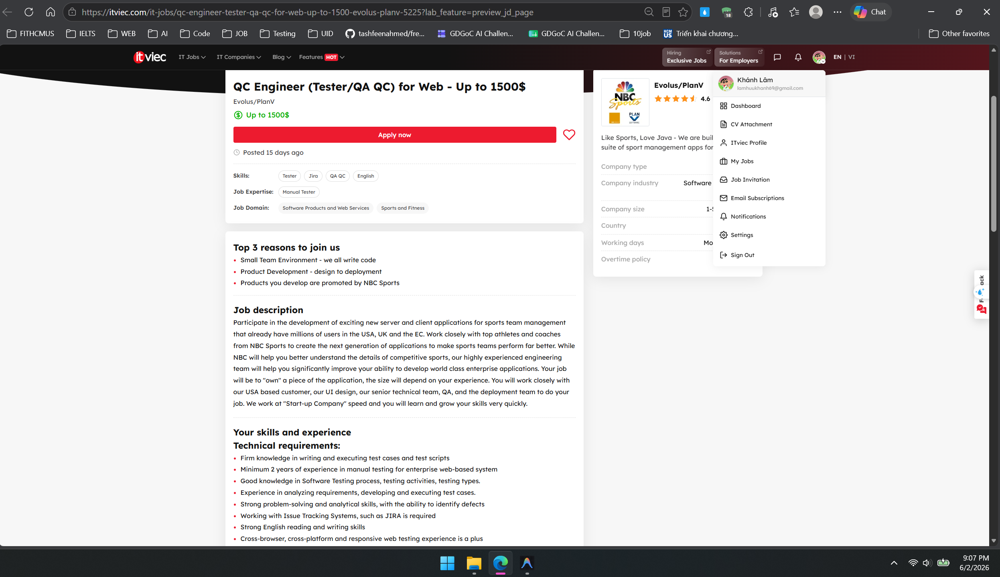  
  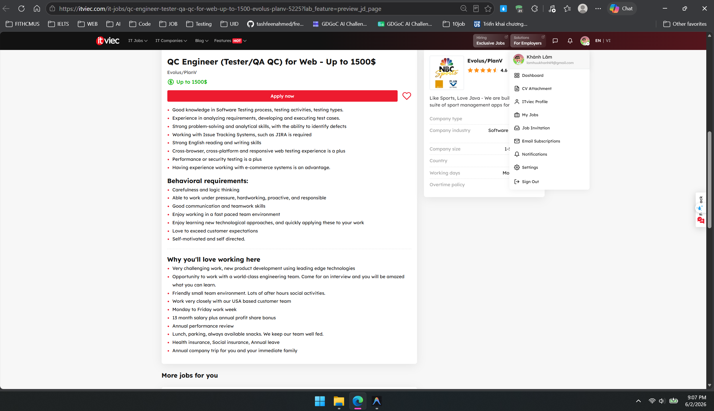  
* **Job Description:**  
  Participate in the development of exciting new server and client applications for sports team management that already have millions of users in the USA, UK and the EC. Work closely with top athletes and coaches from NBC Sports to create the next generation of applications to make sports teams perform far better. You will work closely with USA-based customers, UI designers, the senior technical team, QA, and the deployment team at "Start-up Company" speed.
* **Required Skills:**  
  * Firm knowledge in writing and executing test cases and test scripts.
  * Minimum 2 years of experience in manual testing for enterprise web-based systems.
  * Good knowledge of Software Testing processes, testing activities, and testing types.
  * Experience in analyzing requirements, developing and executing test cases.
  * Strong problem-solving and analytical skills, with the ability to identify defects.
  * Experience working with Issue Tracking Systems (specifically JIRA).
  * Strong English reading and writing skills.
  * Cross-browser, cross-platform, and responsive web testing experience (plus).
  * Performance or security testing (plus).
  * Experience working with e-commerce systems (advantage).
  * Carefulness, logical thinking, proactive, and responsible.
* **Salary:** Up to 1500$
* **AI Impact Analysis:** AI tools can assist by generating test script drafts for sports management workflows, but manual exploratory testing and close collaboration with athletes and coaches still require human communication and visual intuition.

#### 2. Job Posting 2: Mid QC Engineer (Quality Control Engineer) - Moniva Viet Nam
* **Job Link:** [Link](https://glints.com/vn/en/opportunities/jobs/mid-qc-engineer-quality-control-engineer/77afcdf2-9147-4710-a867-002c5bdd1ad5?utm_referrer=explore&utm_source=chatgpt.com&traceInfo=5c9c093964500837adb0d4fdcad860c1)
* **Dated Screenshot:** (Captured on June 02, 2026)  
  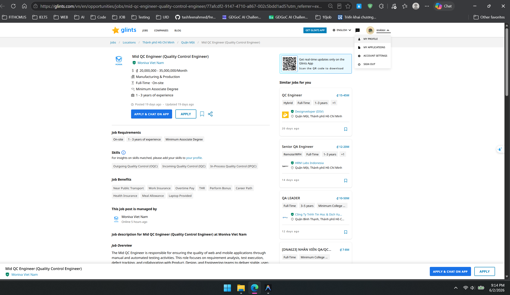  
  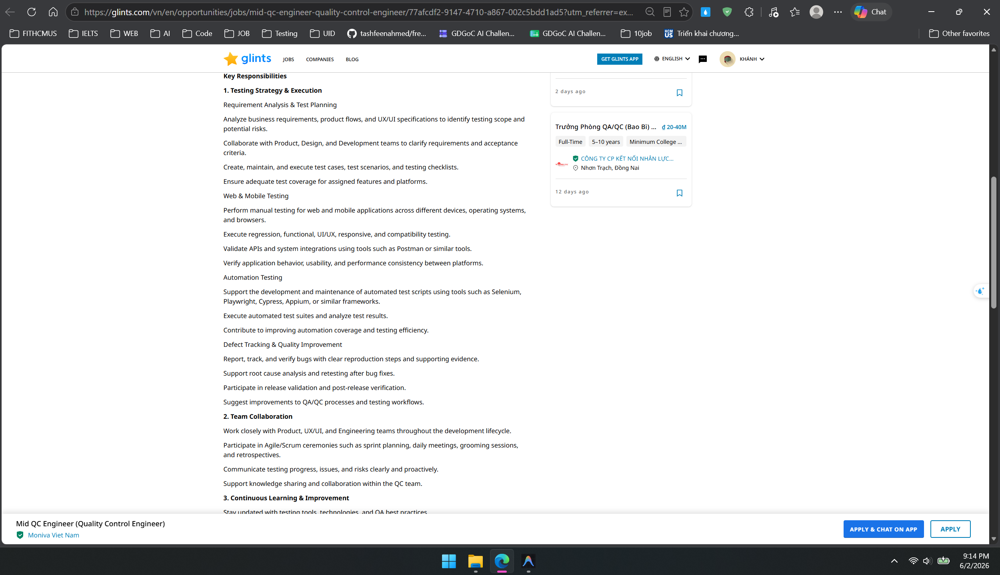  
  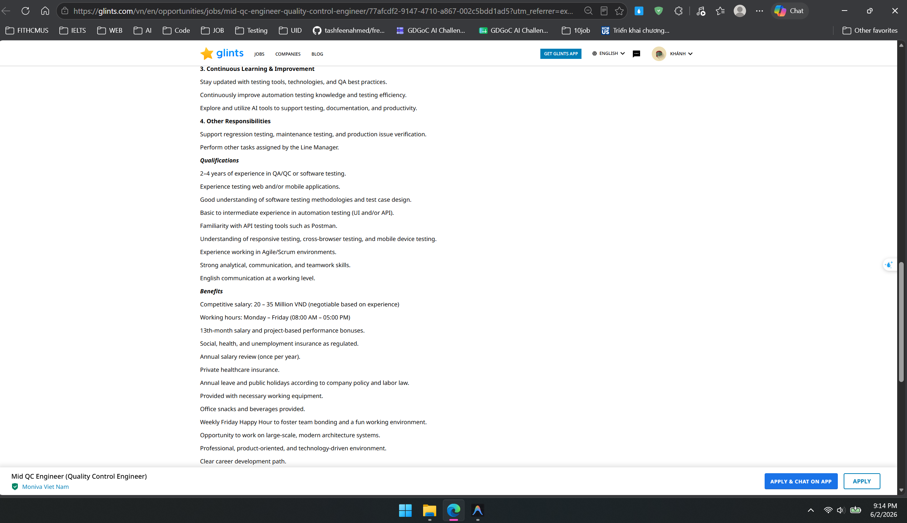  
* **Job Description:**  
  Responsible for ensuring the quality of web and mobile applications through manual and automated testing activities. This role focuses on requirement analysis, test planning, creating and executing test cases, UI/UX/responsive testing across various browsers and mobile devices, API validation using Postman, and supporting automated test script development (Selenium, Playwright, Cypress, Appium).
* **Required Skills:**  
  * 2–4 years of experience in QA/QC or software testing.
  * Experience testing web and/or mobile applications.
  * Good understanding of software testing methodologies and test case design.
  * Basic to intermediate experience in automation testing (UI and/or API) using frameworks like Selenium, Playwright, Cypress, or Appium.
  * Familiarity with API testing tools (Postman or similar).
  * Understanding of responsive testing, cross-browser testing, and mobile device testing.
  * Experience working in Agile/Scrum environments.
  * Strong analytical, communication, and teamwork skills.
  * Working-level English communication skills.
* **Salary:** VND 20,000,000 - 35,000,000/Month
* **AI Impact Analysis:** AI can generate initial test cases from user stories and draft UI/API automation scripts, but subjective UI/UX validation and mobile gesture testing require human verification.

#### 3. Job Posting 3: QC Engineer - Designveloper (DSV)
* **Job Link:** [Link](https://glints.com/vn/en/opportunities/jobs/qc-engineer/5318bee6-b275-43ed-96ac-de48c82a9aac?utm_referrer=explore&utm_source=chatgpt.com&traceInfo=8085d87f-686c-46a1-b133-38bee805d576)
* **Dated Screenshot:** (Captured on June 02, 2026)  
  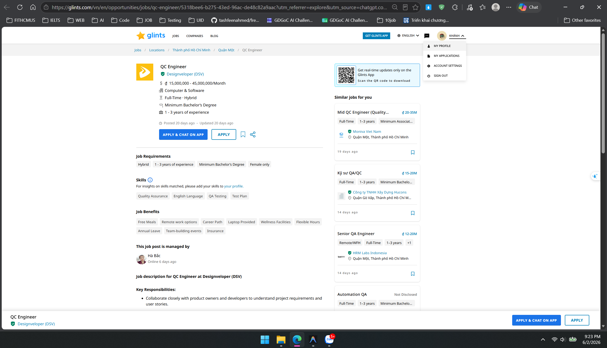  
  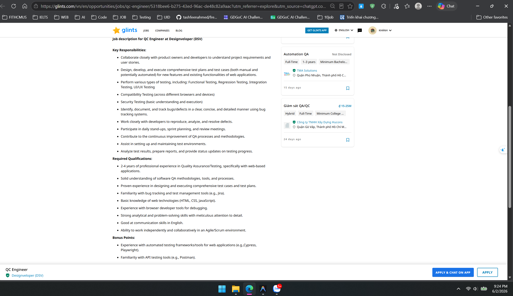  
* **Job Description:**  
  Collaborate closely with product owners and developers to understand project requirements and user stories. Design, develop, and execute comprehensive test plans and test cases (manual and automated) for new features and existing functionalities of web applications. Perform functional, regression, integration, UI/UX, cross-browser/device compatibility, and basic security testing. Identify, document, and track bugs using JIRA, assist in setting up test environments, and prepare quality reports.
* **Required Skills:**  
  * 2–4 years of professional experience in QA/testing, specifically for web applications.
  * Solid understanding of software QA methodologies, tools, and processes.
  * Proven experience in designing and executing comprehensive test cases and test plans.
  * Familiarity with bug tracking and test management tools (specifically JIRA).
  * Basic knowledge of web technologies (HTML, CSS, JavaScript).
  * Experience with browser developer tools for debugging.
  * Strong analytical and problem-solving skills with meticulous attention to detail.
  * Good English communication skills.
  * Ability to work in an Agile/Scrum environment.
  * Bonus: Experience with automation test tools (Cypress, Playwright) and API testing (Postman).
* **Salary:** VND 15,000,000 - 45,000,000/Month
* **AI Impact Analysis:** AI tools help generate functional test cases and boilerplate Cypress/Playwright automation code, but high-level test strategy design and cross-functional team communication remain human-centric.

#### 4. Job Posting 4: Automation QA Engineer (QA QC/Tester/Automation Test) - Nakivo
* **Job Link:** [Link](https://itviec.com/it-jobs/automation-qa-engineer-qa-qc-tester-automation-test-nakivo-0115?lab_feature=preview_jd_page)
* **Dated Screenshot:** (Captured on June 02, 2026)  
  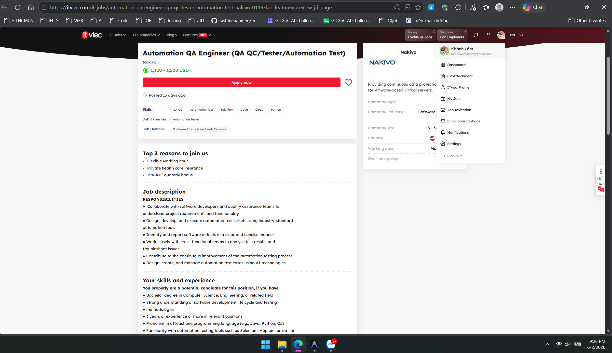  
  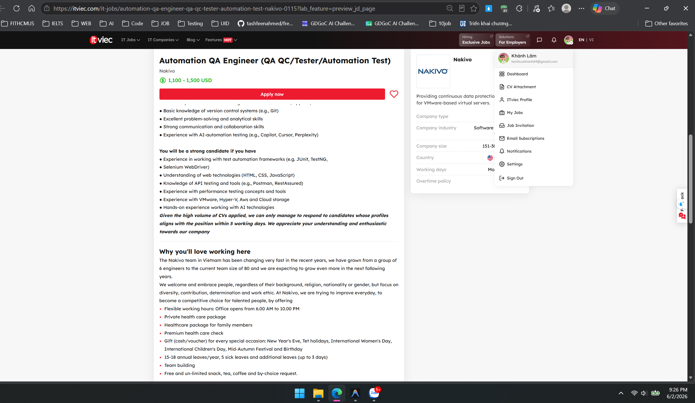  
* **Job Description:**  
  Collaborate with developers and QA teams to understand project requirements. Design, develop, and execute automated test scripts using industry-standard tools. Identify, report, and track defects. Work closely with cross-functional teams to analyze test results and troubleshoot issues. Contribute to the continuous improvement of the testing process. Crucially, design, create, and manage automation test cases using AI technologies (e.g., Copilot, Cursor).
* **Required Skills:**  
  * Bachelor's degree in CS, Engineering, or related field.
  * Strong understanding of SDLC and testing methodologies.
  * 3+ years of experience in automation testing.
  * Proficiency in Java, Python, or C#.
  * Familiarity with automation tools (Selenium, Appium, Git).
  * Hands-on experience with AI-automation testing tools (Copilot, Cursor, Perplexity) and AI technologies.
  * Experience with test automation frameworks (JUnit, TestNG, Selenium WebDriver).
  * Web technologies (HTML, CSS, JavaScript) and API testing (Postman, RestAssured).
  * Understanding of performance testing concepts and virtualization/cloud environments (VMware, Hyper-V, AWS, Cloud storage).
* **Salary:** 1,100 - 1,500 USD
* **AI Impact Analysis:** AI assistants like Copilot and Cursor significantly accelerate the writing of Appium/Selenium test suites, while human engineering is needed to design test architectures and configure cloud VMs.

#### 5. Job Posting 5: Senior QA Engineer - HRM Labs Indonesia
* **Job Link:** [Link](https://glints.com/vn/en/opportunities/jobs/senior-qa-engineer/52fefe91-06f8-4269-8e06-8dafe04b17ea?utm_referrer=explore&utm_source=chatgpt.com&traceInfo=b1635a89-0315-4e4c-8b27-5f2454521df7)
* **Dated Screenshot:** (Captured on June 02, 2026)  
  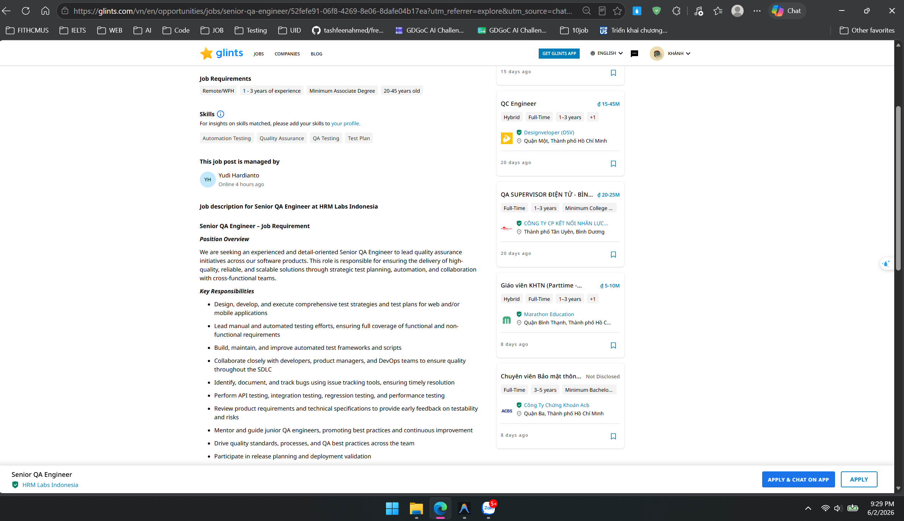  
  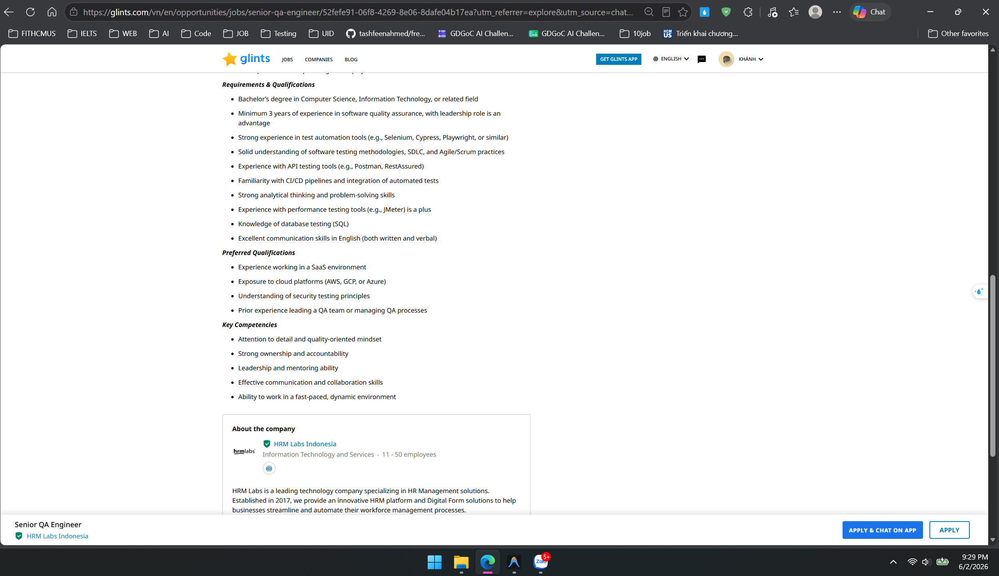  
* **Job Description:**  
  Responsible for leading quality assurance initiatives across software products. This role ensures high-quality, reliable, and scalable solutions through strategic test planning, manual/automated testing, and cross-functional collaboration.  
  Key Responsibilities:  
  * Design, develop, and execute comprehensive test strategies and plans for web/mobile apps.  
  * Lead manual and automated testing efforts to ensure coverage of functional and non-functional requirements.  
  * Build, maintain, and improve automated test frameworks and scripts.  
  * Document and track bugs using issue tracking tools.  
  * Perform API, integration, regression, and performance testing.  
  * Mentor junior QA engineers and drive QA best practices across the team.  
* **Required Skills:**  
  * Bachelor's degree in CS, IT, or related field.  
  * Minimum 3 years of software QA experience (leadership is an advantage).  
  * Strong experience in test automation tools (Selenium, Cypress, Playwright, etc.).  
  * Solid understanding of software testing methodologies, SDLC, and Agile/Scrum.  
  * Experience with API testing tools (Postman, RestAssured) and SQL database testing.  
  * Excellent communication skills in English (written and verbal).  
* **Salary:** VND 12,000,000 - 20,000,000/Month
* **AI Impact Analysis:** AI assistants can write standard Selenium/Playwright scripts and API validation schemas, while design of the comprehensive test plans and mentoring junior staff remain human responsibilities.

#### 6. Job Posting 6: Senior Software Quality Control (QC/ Tester) - SHINHAN DS
* **Job Link:** [Link](https://itviec.com/it-jobs/senior-software-quality-control-qc-tester-shinhan-ds-0741?lab_feature=preview_jd_page)
* **Dated Screenshot:** (Captured on June 02, 2026)  
  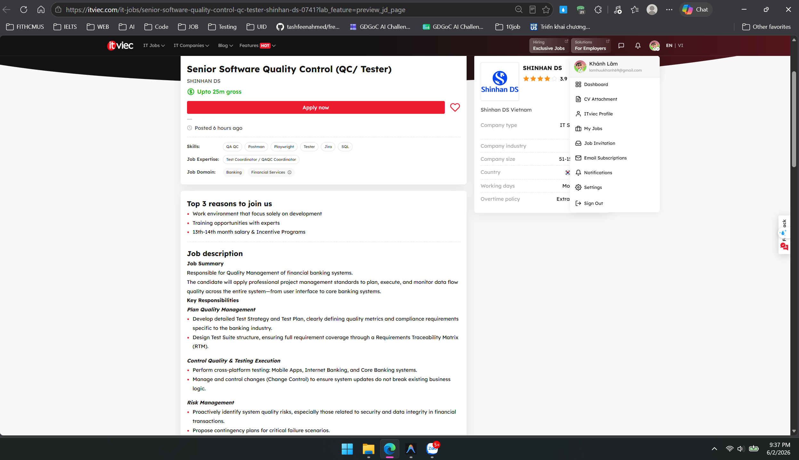  
  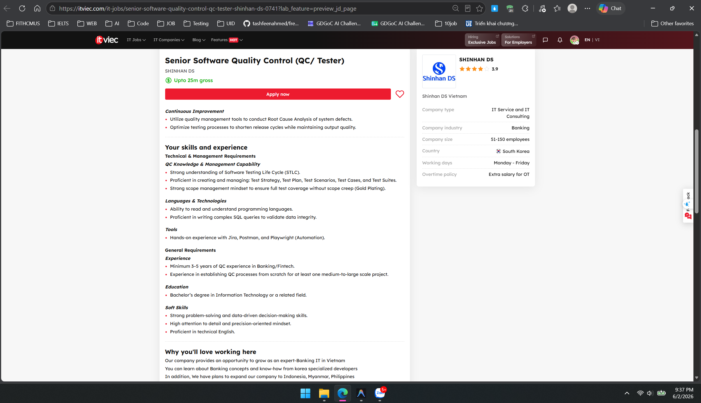  
  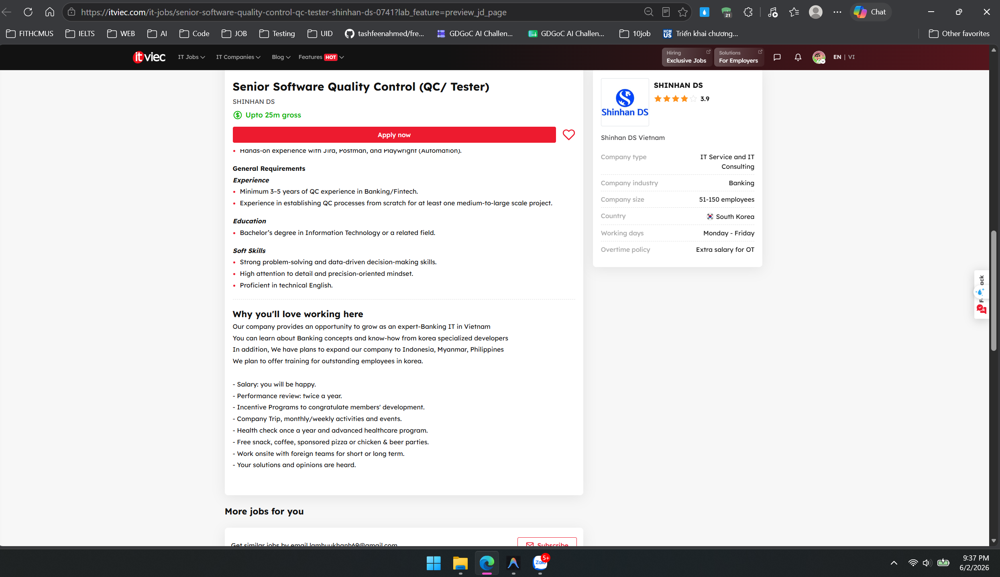  
* **Job Description:**  
  Responsible for Quality Management of financial banking systems. Plan quality management by developing detailed Test Strategies, Test Plans, Test Suite structures, and Requirements Traceability Matrices (RTM). Perform cross-platform testing (Mobile Apps, Internet Banking, Core Banking). Manage Change Control to ensure system updates do not break existing business logic, proactively identify security and data integrity risks, and perform root cause analysis of system defects.
* **Required Skills:**  
  * 3–5 years of QC experience in Banking/Fintech.
  * Experience establishing QC processes from scratch for medium-to-large scale projects.
  * Strong understanding of STLC, Test Strategy, Test Plans, Test Scenarios, and Test Suites.
  * Ability to read and understand programming languages and write complex SQL queries to validate data integrity.
  * Hands-on experience with Jira, Postman, and Playwright (Automation).
  * Good problem-solving, data-driven decision-making, and high attention to detail.
  * Proficient in technical English.
* **Salary:** Up to VND 25,000,000 gross
* **AI Impact Analysis:** AI can draft SQL database verification queries and suggest regression paths, but strict banking security regulations prevent uploading real financial transaction structures to public LLMs.

#### 7. Job Posting 7: Senior QA Engineer (Tester/Business Analyst) - soxes AG
* **Job Link:** [Link](https://itviec.com/it-jobs/senior-qa-engineer-tester-business-analyst-soxes-ag-3239?lab_feature=preview_jd_page)
* **Dated Screenshot:** (Captured on June 02, 2026)  
  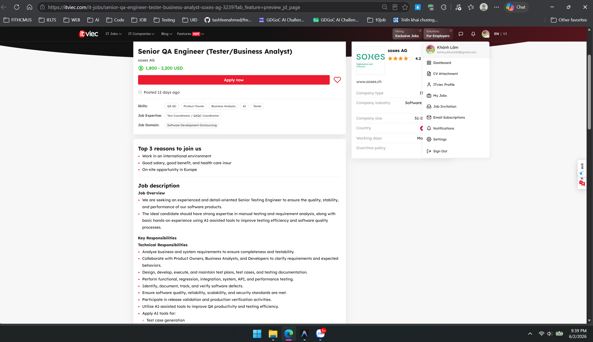  
  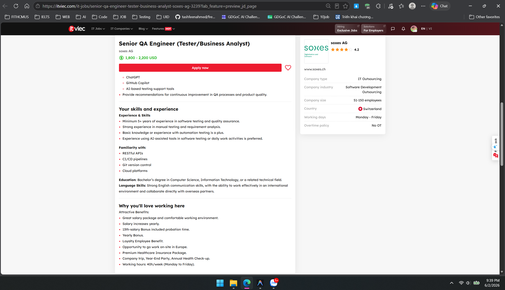  
* **Job Description:**  
  Ensure the quality, stability, and performance of software products. Collaborate with Product Owners, Business Analysts, and Developers to analyze business and system requirements. Design, execute, and maintain test plans, test cases, and test documentation. Perform functional, regression, integration, API, and performance testing. Proactively utilize AI-assisted tools (such as ChatGPT, Copilot, and AI testing support tools) to generate test cases, prepare test data, support documentation, and analyze defects.
* **Required Skills:**  
  * 5+ years of experience in software testing and quality assurance.
  * Strong experience in manual testing and requirement analysis.
  * Experience using AI-assisted tools (ChatGPT, GitHub Copilot, etc.) in testing or daily workflows.
  * Familiarity with RESTful APIs, CI/CD pipelines, Git version control, and cloud platforms.
  * Bachelor's degree in CS, IT, or a related technical field.
  * Strong English communication skills for direct collaboration with overseas partners.
  * Basic knowledge of automation testing (plus).
* **Salary:** 1,800 - 2,200 USD
* **AI Impact Analysis:** AI tools are utilized directly to accelerate manual test case writing and data preparation, but translating overseas business requirements into technical test designs requires human communication.

#### 8. Job Posting 8: QC Manual Engineer - MANDALA CODE
* **Job Link:** [Link](https://vn.indeed.com/cmp/Agapi-Solution/jobs?jk=ce8785388a1f64bb&start=0&clearPrefilter=1)
* **Dated Screenshot:** (Captured on June 02, 2026)  
  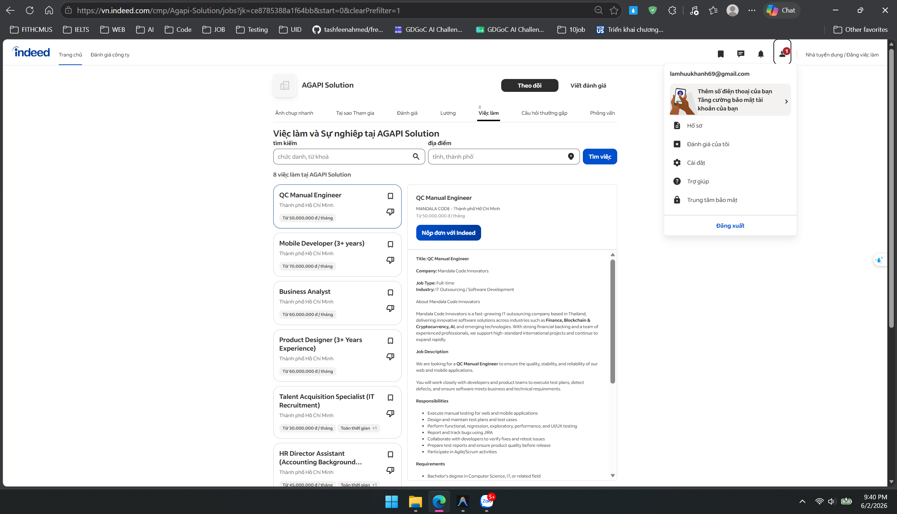  
  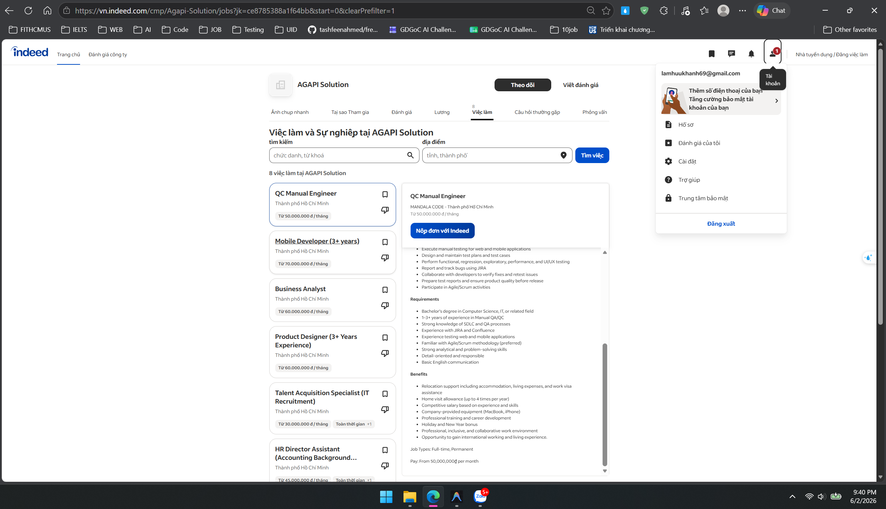  
* **Job Description:**  
  Execute manual testing for web and mobile applications under high-standard international projects in areas such as Finance, Blockchain & Cryptocurrency, AI, and emerging technologies. Design and maintain test plans and test cases. Perform functional, regression, exploratory, performance, and UI/UX testing. Report and track bugs using JIRA, collaborate with developers to verify fixes, and prepare test reports before release.
* **Required Skills:**  
  * Bachelor’s degree in Computer Science, IT, or a related field.
  * 1–3+ years of experience in Manual QA/QC.
  * Strong knowledge of SDLC, QA processes, JIRA, and Confluence.
  * Strong experience testing web and mobile applications.
  * Familiarity with Agile/Scrum methodologies.
  * Detail-oriented, responsible, with strong analytical and problem-solving skills.
  * Basic English communication skills.
* **Salary:** From VND 50,000,000/Month
* **AI Impact Analysis:** AI can assist by generating crypto/blockchain test checklists, but verifying custom smart contract logic and handling decentralized transaction states require manual human verification.

#### 9. Job Posting 9: QA Team Lead - Nakivo
* **Job Link:** [Link](https://itviec.com/it-jobs/qa-team-lead-nakivo-3715?lab_feature=preview_jd_page)
* **Dated Screenshot:** (Captured on June 02, 2026)  
  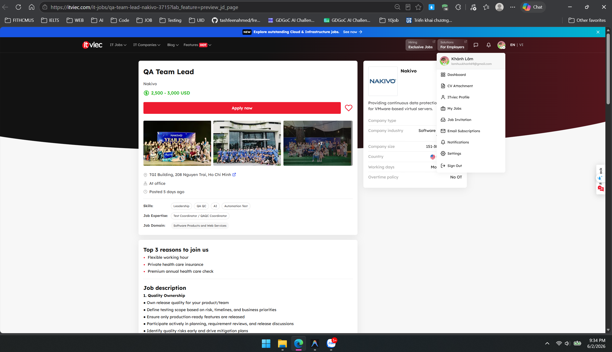  
  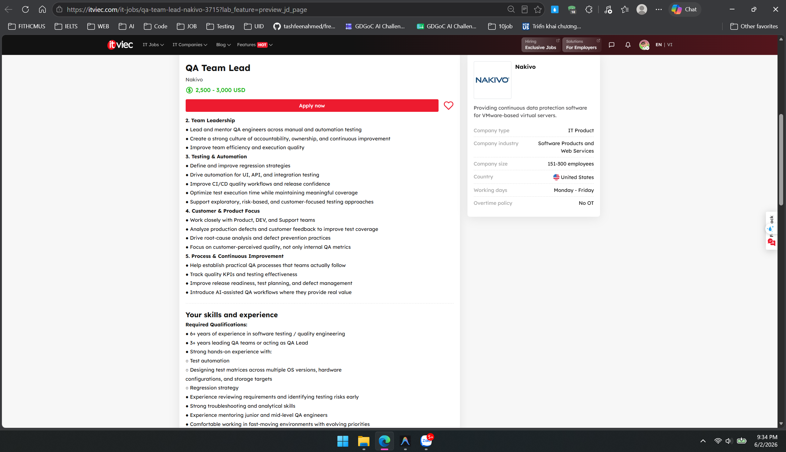  
  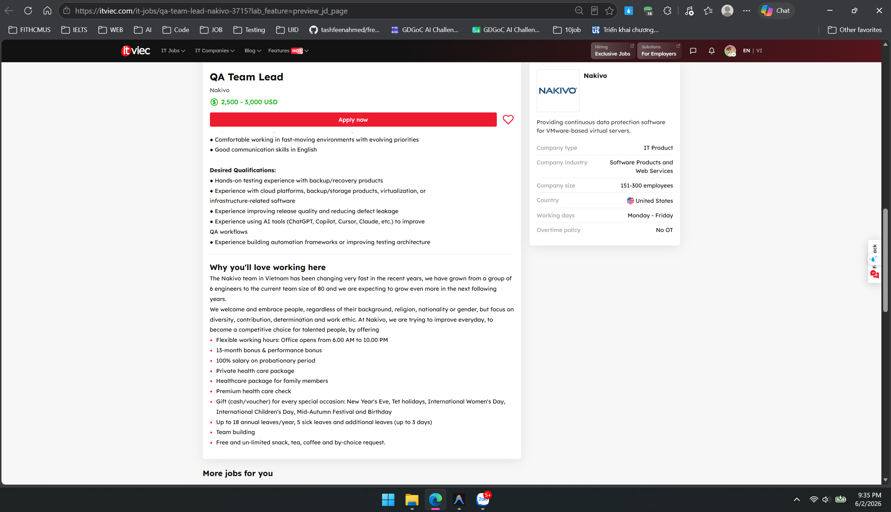  
* **Job Description:**  
  Own release quality for your product/team. Define testing scope based on risk, timelines, and business priorities. Lead and mentor QA engineers across manual and automation testing. Drive regression strategies and test automation for UI, API, and integration testing. Collaborate with Product, DEV, and Support teams to analyze production defects and customer feedback. Help establish practical QA processes and introduce AI-assisted QA workflows.
* **Required Skills:**  
  * 6+ years of experience in software testing / quality engineering, with 3+ years leading QA teams.
  * Strong hands-on experience in test automation, regression strategy, and designing test matrices across multiple OS versions, hardware, and storage targets.
  * Excellent troubleshooting, analytical, and requirement-reviewing skills.
  * Fluent English communication.
  * Desired: Experience with cloud platforms, backup/storage products (backup/recovery), virtualization, or infrastructure-related software.
  * Desired: Experience using AI tools (ChatGPT, Copilot, Cursor, Claude, etc.) to improve QA workflows, and building automation frameworks.
* **Salary:** 2,500 - 3,000 USD
* **AI Impact Analysis:** AI tools can assist the lead in designing complex test matrices and generating risk logs, but final release sign-off and team leadership require human authority and accountability.

#### 10. Job Posting 10: AI First QC and Automation Engineer - L4 Studio
* **Job Link:** [Link](https://www.monster.com.vn/job/ai-first-qc-and-automation-engineer-l4-studio-software-development-company-ho-chi-minh-54401551)
* **Dated Screenshot:** (Captured on June 02, 2026)  
  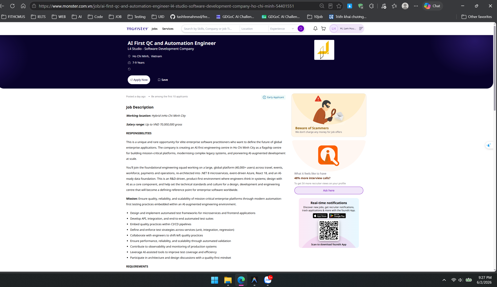  
  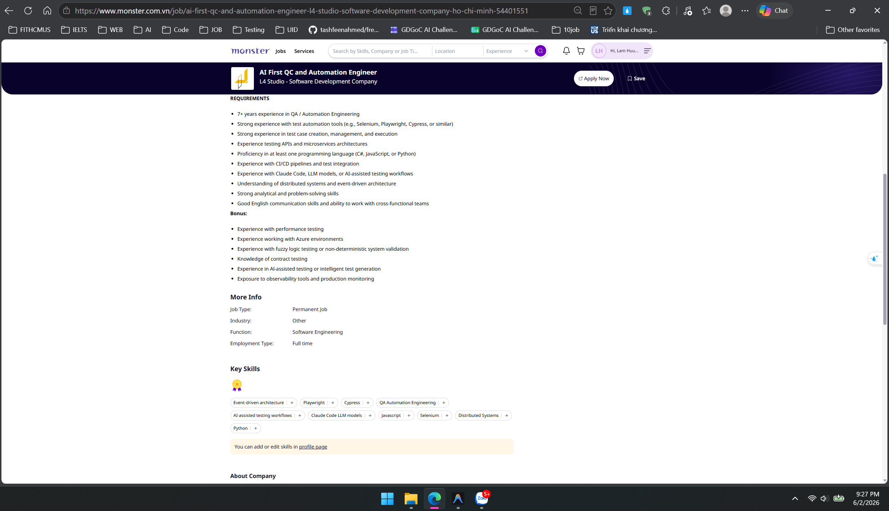  
* **Job Description:**  
  Join a foundational engineering squad to build an AI-first engineering centre in Ho Chi Minh City, developing a large-scale global enterprise platform (40,000+ users).  
  Key Responsibilities:  
  * Design and implement automated test frameworks for microservices and frontend applications.  
  * Develop API, integration, and end-to-end automated test suites.  
  * Embed quality practices within CI/CD pipelines.  
  * Define and enforce test strategies across services (unit, integration, regression).  
  * Collaborate with engineers to shift-left quality practices.  
  * Ensure performance, reliability, and scalability through automated validation.  
  * Leverage AI-assisted tools to improve test coverage and efficiency.  
* **Required Skills:**  
  * 7+ years of experience in QA / Automation Engineering.  
  * Strong experience with test automation tools (Selenium, Playwright, Cypress, etc.) and test case management.  
  * Experience testing APIs and microservices architectures.  
  * Proficiency in C#, JavaScript, or Python.  
  * Experience with CI/CD pipelines, test integration, and event-driven systems.  
  * Experience with Claude Code, LLM models, or AI-assisted testing workflows.  
* **Salary:** Up to VND 70,000,000 gross
* **AI Impact Analysis:** This role leverages AI-assisted workflows (Claude Code) to auto-generate and execute massive test suites, while human engineers remain critical to set event-driven quality gates.

## REQUIREMENT 2: 20 SOFTWARE DEFECTS 2022–2026
*Requirement: List 20 software defects publicized between 2022 and 2026. A minimum of 5 defects must be AI/LLM-related (hallucination, prompt injection, bias). For EACH defect, identify 1 instance where AI is biased or hallucinates when explaining it.*

### Details of 20 Software Defects

#### 1. Defect 1: [Name of Defect/Incident]
* **Source Link:** [URL to the news article or technical write-up]
* **Description:** [Summary of what caused the defect and what occurred]
* **Severity:** [Low / Medium / High / Critical]
* **Consequences:** [Damage caused by the defect, e.g., financial loss, data leak, service downtime]
* **Solution:** [How the defect was resolved or mitigated]
* **AI Bias / Hallucination Instance:**
  * **AI Tool Used:** [E.g., ChatGPT / Claude / Gemini]
  * **Prompt Given to AI:** `[Enter the exact prompt you used to ask the AI to explain the defect]`
  * **AI Explanation Error:** [Describe the specific point where the AI hallucinated, gave incorrect technical details, or showed bias in its explanation. E.g., The AI inaccurately blamed a specific developer or hallucinated a non-existent CVE code for this issue.]

*(Copy and paste this structure for all 20 defects. Ensure at least 5 of them are AI/LLM-related)*

#### 2. Defect 2: [Name of Defect]
* ...

[... Repeat up to Defect 20 ...]

---

## REQUIREMENT 3: TEST CASES FOR ONE PHYSICAL PRODUCT
*Requirement: Choose a specific physical household device, take a photo of it with your student ID, design 15 test cases (with at least 3 edge cases the AI missed), find 5 physical defects logged on GitHub Issues, and provide 5 execution videos.*

### 1. Device Under Test (DUT) Declaration
* **Device Type:** [E.g., Stand Fan / Water Filter / Rice Cooker / Smart Bulb]
* **Brand:** [E.g., Philips / Xiaomi / Panasonic]
* **Model:** [E.g., HD9200]
* **Year of Manufacture:** [E.g., 2024]
* **Serial Number:** [E.g., SN987XXXX321 - Mask the middle 4 characters]
* **Photo of DUT and Student ID (same frame):**  
  

### 2. List of 15 Test Cases
*(This table should be synchronized with your Excel sheet)*

| Test ID | Objective | Input | Steps | Expected Result | Actual Result | Verdict (Pass/Fail) |
| :---: | :--- | :--- | :--- | :--- | :--- | :---: |
| TC-01 | [Test Objective] | [Inputs] | 1. Press button A...<br>2. Observe... | [Expected behavior] | [Actual observed behavior] | [Pass/Fail] |
| TC-02 | ... | ... | ... | ... | ... | ... |
| ... | ... | ... | ... | ... | ... | ... |
| TC-15 | ... | ... | ... | ... | ... | ... |

### 3. Analysis of 3 Edge Cases Missed by AI
*Requirement: Provide both screenshots showing the AI conversation where the AI did not generate these edge cases, and a written explanation of why.*

#### Edge Case 1: [Edge Case Title]
* **Edge Case Description:** [Describe this specific test scenario]
* **Evidence of AI Missing it:**  
    
  *(Screenshot showing the AI did not generate this edge case when asked)*
* **Why AI Missed It:** [Explain the technical reason why the AI failed to identify this scenario. E.g., The AI has no physical sense of friction or wear-and-tear of mechanical gears over time.]

#### Edge Case 2: [Edge Case Title]
* **Evidence of AI Missing it:** 
* **Why AI Missed It:** ...

#### Edge Case 3: [Edge Case Title]
* **Evidence of AI Missing it:** 
* **Why AI Missed It:** ...

### 4. Physical Defects Reporting (GitHub Issues)
*Requirement: Find and report at least 5 defects from the device during execution as Issues in your own GitHub repository.*

* **Link to GitHub Issues:** [Direct link to your repository's Issues page]
* **Screenshot of GitHub Issues List:**  
  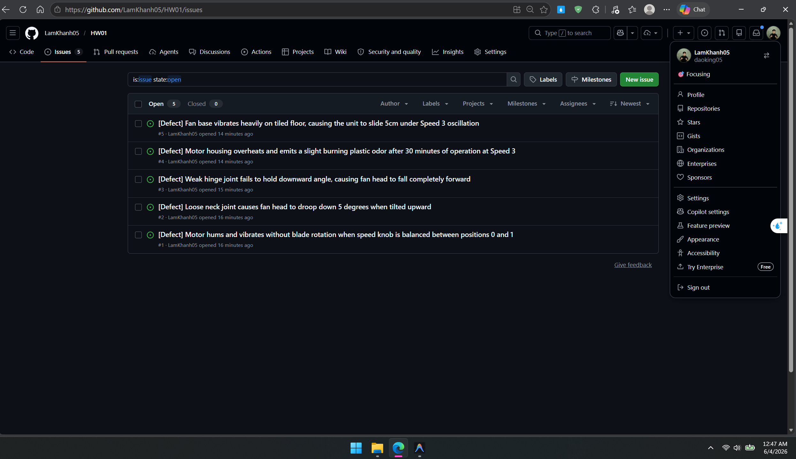  
  *(Make sure the screenshot shows your GitHub username in the corner)*

### 5. List of Execution Videos (YouTube Unlisted)
*Requirement: Provide unlisted YouTube links for at least 5 test cases with your own voice narration (max 60s per video).*

1. **Video 1 (TC-XX):** [Test Case Title] - [YouTube Unlisted Link]
2. **Video 2 (TC-XX):** [Test Case Title] - [YouTube Unlisted Link]
3. **Video 3 (TC-XX):** [Test Case Title] - [YouTube Unlisted Link]
4. **Video 4 (TC-XX):** [Test Case Title] - [YouTube Unlisted Link]
5. **Video 5 (TC-XX):** [Test Case Title] - [YouTube Unlisted Link]

---

## AI COLLABORATION PROTOCOL

### 1. QA/QC Role Mindmap Correction (CLO G9.1)
* **AI-generated Mindmap:** 
* **3 Mistakes Identified in AI Mindmap:**
  1. **Mistake 1:** [Describe the mistake or gap in the AI's mindmap and why it is wrong]
  2. **Mistake 2:** [Describe the mistake or gap in the AI's mindmap and why it is wrong]
  3. **Mistake 3:** [Describe the mistake or gap in the AI's mindmap and why it is wrong]
* **Final Corrected Mindmap:**  
  

### 2. AI Audit Report ([AI-02])
*(One batch generated by a single prompt counts as one artifact/entry)*

#### Artifact 1: [E.g., Generating 15 test cases for Rice Cooker]
* **(1) Prompt + tool:**  
  * **AI Tool Name:** [E.g., ChatGPT-4o]  
  * **Timestamp:** [HH:MM dd/mm/yyyy]  
  * **Prompt:**  
    ```text
    [Insert the exact full prompt you used]
    ```
* **(2) AI output:**  
  * [Insert full AI output or annotated screenshot]
* **(3) Verdict:** [VALID / INVALID / INCOMPLETE]
* **(4) Reasoning:** [2-5 sentences citing the matching slide / ISTQB section to justify the verdict]
* **(5) Student fix:**  
  * [Insert your corrected/modified version of the artifact. Use **bold** text to highlight changes]

*(Copy and paste the structure above if you have more artifacts, e.g., Artifact 2, Artifact 3)*

#### AI Accuracy Ratio Summary
* **Total Audited Artifacts:** [Number]
* **Percentages:**
  * **VALID:** [Percentage]%
  * **INVALID:** [Percentage]%
  * **INCOMPLETE:** [Percentage]%
* **Conclusion (When should AI be used / not used):**  
  [Provide your conclusion paragraph here]

### 3. AI Critique (200–300 words)
*Requirement: Write a paragraph critiquing the AI. Explain where it got things wrong, biased, or incomplete, why it failed, and what principles you learned.*

[Insert your 200-300 word critique paragraph here]

### 4. Mandatory Disclosure
*Requirement: Paste this standard template at the end of the report before appendices/forms.*

> **[Test cases / script / dataset / report]** was initially generated by **[AI tool name]**; I reviewed and modified **[section X]**, added **[edge cases Y, Z]**; **[section W]** was written entirely by me. The detailed AI Audit Report is attached as Appendix A. I confirm I did not use AI to generate any artifact listed in the prohibited category below.

*(Fill in the square brackets with the correct details before submitting)*

---

## SELF-ASSESSMENT RUBRIC
*Grade yourself honestly according to the official rubric weights.*

| No. | Criteria | Max Grade | Self-Assessed Grade | Student Evidence & Notes |
| :---: | :--- | :---: | :---: | :--- |
| **1** | Job Market 2026+ (10 jobs × 3 pts + AI Impact) | 40 | [Fill] | Completed 10 jobs, 3 require AI, screenshots with account name. |
| **2** | Software Defects 2022–2026 (20 defects) | 20 | [Fill] | 20 defects documented, 5 AI-related, 20 AI mistake instances found. |
| **3** | Physical-product test design (15 TCs + 5 videos) | 25 | [Fill] | 15 TCs designed, 3 edge cases AI missed, 5 GitHub Issues, 5 videos. |
| **AI-1** | [AI-02] AI Audit Report (5-section) attached | 8 | [Fill] | Audited each AI artifact using the 5-section format. |
| **AI-2** | AI Critique 200–300 words + [AI-03] Disclosure | 4 | [Fill] | Critique paragraph written, AI-03 form signed and attached. |
| **AI-3** | [AI-05] Checklist signed + anti-cheat artifacts | 3 | [Fill] | AI-05 signed, DUT photo with Student ID in frame. |
| | **TOTAL** | **100** | **[Total]** | |
