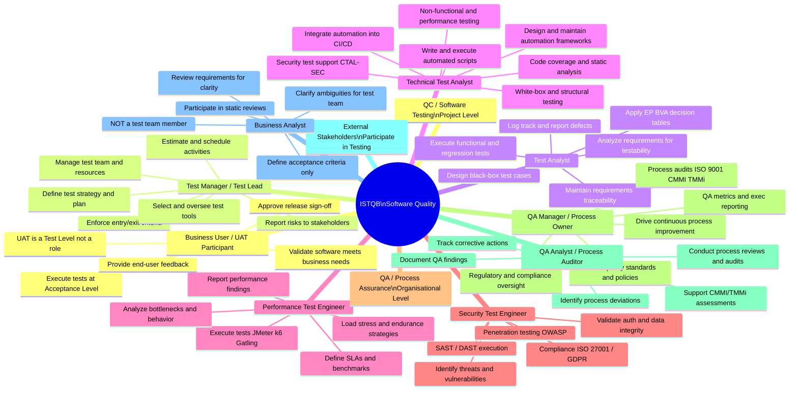

```mermaid
mindmap
root((ISTQB\nSoftware Quality))
    QC / Software Testing\nProject Level
    Test Manager / Test Lead
        Define test strategy and plan
        Estimate and schedule activities
        Manage test team and resources
        Report risks to stakeholders
        Enforce entry/exit criteria
        Select and oversee test tools
    Test Analyst
        Analyze requirements for testability
        Design black-box test cases
        Apply EP BVA decision tables
        Execute functional and regression tests
        Log track and report defects
        Maintain requirements traceability
    Technical Test Analyst
        White-box and structural testing
        Design and maintain automation frameworks
        Write and execute automated scripts
        Integrate automation into CI/CD
        Code coverage and static analysis
        Non-functional and performance testing
        Security test support CTAL-SEC
    Performance Test Engineer
        Load stress and endurance strategies
        Define SLAs and benchmarks
        Execute tests JMeter k6 Gatling
        Analyze bottlenecks and behavior
        Report performance findings
    Security Test Engineer
        Identify threats and vulnerabilities
        Penetration testing OWASP
        SAST / DAST execution
        Validate auth and data integrity
        Compliance ISO 27001 / GDPR
    QA / Process Assurance\nOrganisational Level
    QA Manager / Process Owner
        Define quality standards and policies
        Process audits ISO 9001 CMMI TMMi
        Regulatory and compliance oversight
        Drive continuous process improvement
        QA metrics and exec reporting
    QA Analyst / Process Auditor
        Conduct process reviews and audits
        Identify process deviations
        Support CMMI/TMMi assessments
        Document QA findings
        Track corrective actions
    External Stakeholders\nParticipate in Testing
    Business Analyst
        Participate in static reviews
        Review requirements for clarity
        Define acceptance criteria only
        Clarify ambiguities for test team
        NOT a test team member
    Business User / UAT Participant
        Execute tests at Acceptance Level
        Validate software meets business needs
        Provide end-user feedback
        Approve release sign-off
        UAT is a Test Level not a role
```
